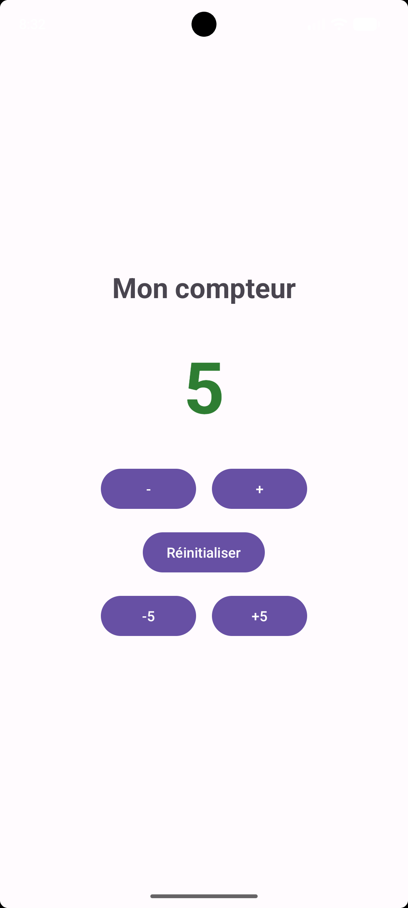

# CompteurAndroid

**Nom et prénom :** Mohamed Aziz Grolli
**Groupe :** L3DSI G2
**Langage :** Kotlin

## Description
Application Android qui affiche un compteur modifiable avec les boutons +, -, +5, -5 et Réinitialiser.

## Fonctionnalités
- Compteur initialisé à 0, valeurs négatives autorisées
- Boutons +, -, +5, -5 et Réinitialiser
- Couleur : vert (positif), rouge (négatif), noir (zéro)
- Message Toast lors de la réinitialisation
- Valeur conservée après rotation de l'écran
- Textes déclarés dans `strings.xml`

## Capture d'écran

## Fichiers principaux
- `app/src/main/res/layout/activity_main.xml`
- `app/src/main/java/com/example/compteurandroid/MainActivity.kt`
- `app/src/main/res/values/strings.xml`

## Compte rendu : difficultés rencontrées
- J'ai d'abord choisi le modèle *Empty Activity* (Jetpack Compose) au lieu de *Empty Views Activity*, donc le fichier `activity_main.xml` n'existait pas. J'ai recréé le projet avec le bon modèle.
- La première synchronisation Gradle était longue, et tant qu'elle n'était pas terminée, des erreurs `Unresolved reference` apparaissaient sur `findViewById`.
- Après une rotation de l'écran, le compteur revenait à 0 car Android recrée l'activité. J'ai résolu le problème avec `onSaveInstanceState`.
- Je n'ai pas empêché le compteur de descendre sous zéro, car cela contredit le test obligatoire qui demande qu'il puisse afficher une valeur négative.
